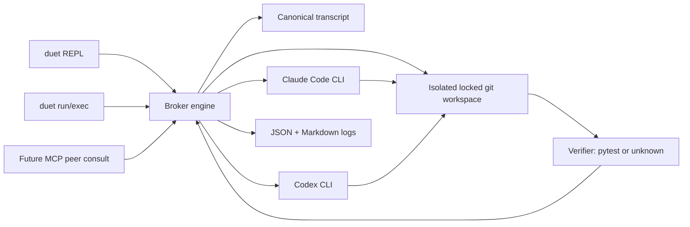

# Duet

Make Claude and Codex collaborate in your terminal, with the orchestrator deciding when they're actually done.

## Requirements

- Claude Code installed and authenticated: `claude`
- OpenAI Codex installed and authenticated: `codex`
- Git
- Python 3.11+

Duet does not bundle, install, or manage Claude Code, Codex, or their accounts. It is a conductor; the performers must already be present and logged in, like a tool that wraps `git` or `ffmpeg`.

## Quickstart

```bash
pipx install duet
duet doctor
duet
```

For development from this checkout:

```bash
pip install -e .
duet doctor
duet run --seed-demo --max-turns 6 --verify pytest
```

Piped stdin auto-routes to headless mode:

```bash
echo "Implement the task in this workspace" | duet
```

## Architecture



## CLI

```bash
duet                         # REPL when stdin is a TTY
duet run "Fix the bug"       # headless one-shot in a scratch workspace
duet exec "Fix the bug"      # alias for run
duet doctor                  # preflight
duet status --repo PATH      # detect agent sessions/processes for a repo (live vs idle)
duet connect --repo PATH "…" # resume existing claude+codex sessions as one duet
duet sessions --repo PATH    # list Claude Code sessions available to attach
duet sessions codex          # list Codex sessions (most recent first, with cwd)
duet talk claude "..."       # one solo turn, resuming that agent's newest session
duet stop                    # list running duet/claude/codex sessions, pick one to stop
duet stop codex --yes        # stop without prompting (SIGINT; --force for SIGTERM)
duet peek codex              # read-only tail of the most recent Codex session
duet peek claude ID --repo P # same for a Claude Code session of repo P
duet replay transcript.json  # render markdown
duet init --project          # write ./duet.toml
duet init --user             # write ~/.config/duet/config.toml
duet --version
```

Global flags: `--log-level DEBUG|INFO|WARNING|ERROR` (or `DUET_LOG`) and
`--log-file PATH` (or `DUET_LOG_FILE`) enable structured logging.

## Working on an existing repo (live mode)

By default `duet run` operates in a disposable scratch workspace. To let the
agents work on a real repository, point `--repo` at it:

```bash
duet run --repo /path/to/project "Add retry logic to the HTTP client" --verify pytest
```

Live mode is safe by default:

- The target must be a git work tree, and by default its tree must be **clean**
  so unrelated uncommitted work is never swept into Duet's commits. Pass
  `--allow-dirty` to override.
- Duet checks out a fresh `duet/session-<timestamp>` branch and records the base
  commit. **All agent commits land on that branch only** — your original branch
  is never modified.
- Duet never merges. When the session ends you review the branch
  (`git log`, `git diff`) and merge deliberately.
- `--rollback-on-failure` discards the Duet branch if the session does not
  succeed (or is interrupted); otherwise the branch is left for inspection.
- `--branch NAME` overrides the generated branch name.

Because the bundled agent commands run non-interactively
(`--dangerously-skip-permissions` for Claude, `--ask-for-approval never` for
Codex), the branch isolation and rollback are the guardrails on a live repo. If
you want an interactive approval gate instead, edit the agent `command` in your
`duet.toml`; branch isolation still applies.

## Attaching to an existing agent session

Duet can resume an agent CLI session that already exists — for example a Claude
Code session another operator (or you) previously ran against the same repo —
so the Duet performer starts with that session's full context instead of cold.

```bash
duet sessions --repo /path/to/project          # find the session id
duet run --repo /path/to/project \
  --attach claude=<session-id> \
  "Continue the audit you were running; close out the remaining findings"
```

- `--attach AGENT=SESSION_ID` (repeatable) resumes that agent via its
  `resume_command` from `duet.toml` (`claude -p --resume`, `codex exec resume`).
- Attaching implies **session chaining**: each turn returns a fresh session id
  and Duet feeds it into the next turn's resume, so the conversation stays one
  continuous thread across the whole Duet run.
- `--chain-sessions` enables the same chaining for cold-started agents, giving
  performers real cross-turn memory instead of relying only on the re-fed
  transcript.
- The final summary prints each agent's last session id so a later
  `duet run --attach` can pick up exactly where the run stopped.

Honest limits: resuming *forks* the stored conversation state. If the original
session is still open in another terminal, that terminal will not see Duet's
messages — this is "continue that agent's memory", not "type into its window".
Attach to sessions that are idle or finished. Run with `--repo` pointing at the
same directory the session was recorded in, since Claude Code stores sessions
per project directory.

To observe a session that is still running, use `duet peek` instead of
attaching. Peek only reads the session's transcript file (recent messages and
tool calls, newest last) and never locks, mutates, or forks it:

```bash
duet sessions codex                 # find the live session and its cwd
duet peek codex                     # tail the most recent one
duet peek codex <session-id> --lines 50
```

## Connecting independent sessions into a duet

When Claude Code and Codex have each been working on the same repo in separate,
unrelated sessions, `duet connect` turns them into one brokered duet without
losing either agent's context:

```bash
duet status --repo /path/to/project    # who's there? live or idle?
duet connect --repo /path/to/project "Reconcile your work and finish the task"
```

`connect` detects each agent's newest session for the repo (Claude sessions are
matched by project directory; Codex sessions by recorded cwd, including
ancestors) and resumes both into the broker loop. Detection is automatic but
overridable with `--claude SESSION_ID` / `--codex SESSION_ID`. An agent with no
session for the repo is cold-started — so `connect` also covers the "launch the
missing partner" case.

Safety: a session whose transcript was written in the last three minutes is
classified **LIVE**, and `connect` refuses to resume it — resuming would fork
the conversation out from under the running agent. Peek at it instead, wait for
it to go idle, or pass `--fork-live` to accept the fork deliberately.

Multiple duets can run in parallel: each `duet run`/`connect` takes a workspace
lock and its own `duet/session-*` branch, so concurrent sessions on different
repos (or worktrees of one repo) do not interfere. Duet does not open terminal
windows for you; run each session in its own terminal or under `tmux`.

## When an agent runs out of usage limit

Quota/rate-limit failures are detected (the CLI's error output is scanned for
usage-limit signals) and handled per the `--on-quota` policy, configurable in
`[session]` or per run on `duet run`/`exec`/`connect`:

- **`halt`** (default): stop cleanly. Completed turns are already committed on
  the duet branch, the transcript is saved, and each agent's session id is
  printed — when the limit resets, `duet connect` resumes both agents with
  full context.
- **`solo`**: drop the exhausted agent from the rotation and let the surviving
  agent finish alone. The transcript records a note that the partner's
  review/verification is pending, and success no longer waits for the dropped
  agent to have spoken.
- **`wait`**: sleep `--quota-wait-seconds` (default 300) and retry the same
  agent, as long as the next wait still fits inside the wallclock budget;
  otherwise halt with the same resumable state as `halt`.

`duet doctor` (run automatically before headless sessions) does an
authenticated round-trip per agent, so a limit that is already exhausted
aborts the run before any turns are spent.

## Controlling sessions individually

`duet talk` continues one agent on its own — no broker, no partner, no branch
isolation (the agent acts directly in `--repo` with the same permissions as a
duet turn). It resumes the agent's newest session for the repo (live guard
applies), sends one message, prints the reply and the session id to continue
from. `--new` starts fresh; `--session ID` picks a specific session.

`duet stop` handles shutdown. With no arguments it lists everything stoppable —
a duet run holding the repo's lock (by pid), and any claude/codex CLI processes
(by tty and runtime, since an outside process cannot be tied to a session file)
— and asks which to stop. It sends SIGINT (what Ctrl-C in that terminal would
do) so the agent exits cleanly; `--force` escalates to SIGTERM. `--yes` skips
the prompt and is required when stdin is not a TTY. Stopping an agent's TUI
does not destroy its session: the transcript stays on disk and `duet connect`,
`duet talk`, or the agent's own resume command can pick it up later.

## Production hardening

- Subprocess timeouts with process-tree kill for agents, and a bounded timeout
  for the pytest verifier so a hanging test cannot wedge the session.
- Git failures are surfaced as clean halts, not crashes; agent/verifier output
  stored in transcripts is size-bounded to protect memory.
- The workspace lock records its PID and is reclaimed automatically if the
  owning process has died; SIGINT/SIGTERM trigger a graceful shutdown that
  releases the lock and honors rollback intent.
- Malformed config files fail fast with a clear `ConfigError`.

Config precedence is deterministic: `--config PATH`, then `./duet.toml`, then `$XDG_CONFIG_HOME/duet/config.toml` or `~/.config/duet/config.toml`, then the built-in detected defaults.

## Design Decisions

Sequential turns are the concurrency-safety model. Duet never runs Claude and Codex at the same time, so there is no file-write race to resolve.

Git is the audit trail. Duet initializes the workspace as a git repository, sets repo-local committer identity, and commits after each turn with the active agent as author.

Termination is execution-grounded when a verifier is configured. For coding tasks, `PytestVerifier` runs `pytest -q` after every turn; passing tests can stop the session without trusting an agent's claim.

The engine/interface split is deliberate. The REPL, headless `run/exec`, and a future MCP peer-consult server are thin front-ends over the same broker API.

Solo mode is supported. If exactly one agent is installed and authenticated, Duet still launches as a front-end to that agent and clearly reports that collaboration is disabled.

The runtime core has zero third-party dependencies. `pytest` is only a development/test dependency.

## Stop Policy

Duet checks these conditions after every turn: `VerifierStop`, `ControlToken`, `MaxTurns`, `WallClockBudget`, and `LoopDetector`. The final summary reports the outcome and the condition that fired.

## Limitations

Each turn calls a frontier coding CLI and consumes from the configured account or plan. Keep `max_turns` low.

Agent behavior is nondeterministic. Duet provides bounded prompts, git auditability, and verifier-backed stopping, but convergence is not guaranteed for arbitrary tasks.

The practical audience is people who already use Claude Code and Codex locally. Headless auth and sandbox semantics are owned by those CLIs.

On Windows, prefer WSL for consistent subprocess and sandbox behavior.
