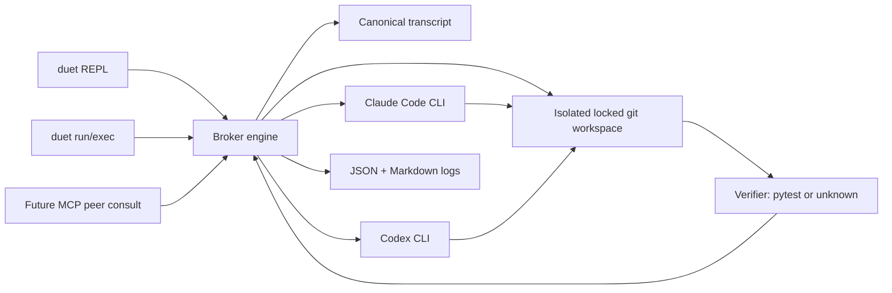

# Duet

Make Claude and Codex collaborate in your terminal, with the orchestrator deciding when they're actually done.

## Requirements

- Claude Code installed and authenticated: `claude`
- OpenAI Codex installed and authenticated: `codex`
- Git
- Python 3.11+

Duet does not bundle, install, or manage Claude Code, Codex, or their accounts. It is a conductor; the performers must already be present and logged in, like a tool that wraps `git` or `ffmpeg`.

## Quickstart

```bash
pipx install duet
duet doctor
duet
```

For development from this checkout:

```bash
pip install -e .
duet doctor
duet run --seed-demo --max-turns 6 --verify pytest
```

Piped stdin auto-routes to headless mode:

```bash
echo "Implement the task in this workspace" | duet
```

## Architecture



## CLI

```bash
duet                         # REPL when stdin is a TTY
duet run "Fix the bug"       # headless one-shot
duet exec "Fix the bug"      # alias for run
duet doctor                  # preflight
duet replay transcript.json  # render markdown
duet init --project          # write ./duet.toml
duet init --user             # write ~/.config/duet/config.toml
duet --version
```

Config precedence is deterministic: `--config PATH`, then `./duet.toml`, then `$XDG_CONFIG_HOME/duet/config.toml` or `~/.config/duet/config.toml`, then the built-in detected defaults.

## Design Decisions

Sequential turns are the concurrency-safety model. Duet never runs Claude and Codex at the same time, so there is no file-write race to resolve.

Git is the audit trail. Duet initializes the workspace as a git repository, sets repo-local committer identity, and commits after each turn with the active agent as author.

Termination is execution-grounded when a verifier is configured. For coding tasks, `PytestVerifier` runs `pytest -q` after every turn; passing tests can stop the session without trusting an agent's claim.

The engine/interface split is deliberate. The REPL, headless `run/exec`, and a future MCP peer-consult server are thin front-ends over the same broker API.

Solo mode is supported. If exactly one agent is installed and authenticated, Duet still launches as a front-end to that agent and clearly reports that collaboration is disabled.

The runtime core has zero third-party dependencies. `pytest` is only a development/test dependency.

## Stop Policy

Duet checks these conditions after every turn: `VerifierStop`, `ControlToken`, `MaxTurns`, `WallClockBudget`, and `LoopDetector`. The final summary reports the outcome and the condition that fired.

## Limitations

Each turn calls a frontier coding CLI and consumes from the configured account or plan. Keep `max_turns` low.

Agent behavior is nondeterministic. Duet provides bounded prompts, git auditability, and verifier-backed stopping, but convergence is not guaranteed for arbitrary tasks.

The practical audience is people who already use Claude Code and Codex locally. Headless auth and sandbox semantics are owned by those CLIs.

On Windows, prefer WSL for consistent subprocess and sandbox behavior.
